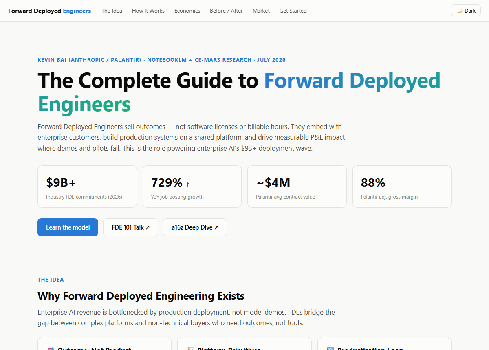

# Forward Deployed Engineers — Interactive Guide

> **The complete guide to Forward Deployed Engineering** — an interactive single-page explainer
> covering the enterprise AI deployment model pioneered by Palantir and now adopted by
> OpenAI, Anthropic, Microsoft, AWS, and dozens of specialists.

[**FDE 101 Talk**](https://www.youtube.com/watch?v=KwhgfwOSToQ) ·
[**a16z Deep Dive**](https://a16z.com/services-led-growth/) ·
[**Plank Research**](https://joinplank.com/state-of-fde)

---



## 🚀 Quick start

No build step, no server, no dependencies:

```bash
start index.html        # Windows
open index.html         # macOS
```

Or serve it (e.g. for GitHub Pages):

```bash
python -m http.server 8000
# → http://localhost:8000
```

## ✨ What's inside

| Section | What it does |
|---|---|
| **The Idea** | Why FDE exists — outcomes over products, platform primitives, productization loop |
| **How It Works** | Clickable 5-stage engagement lifecycle with per-stage explanations |
| **Simulator** | Press ▶ and watch an illustrative FDE engagement play out ($0 → $4.1M ARR) |
| **Economics** | Animated before/after charts: ACV comparison + Palantir margin metrics |
| **Before / After** | Tabbed comparison of Traditional PS vs FDE operating model |
| **Market Landscape** | Who's building FDE orgs in 2026 ($9B+ in commitments) |
| **Get Started** | Curated learning path with copy-button links |

Extras: light/dark theme toggle (remembers your choice), scroll-triggered chart
animation, hover tooltips, fully responsive.

## 📊 The numbers (from the sources)

The FDE model drives significantly higher contract values and margins compared to traditional software sales or professional services:

| Metric | Traditional PS | FDE Model (Palantir) | Δ |
|---|---:|---:|---:|
| Average Contract Value | <$500K | **~$4M** | +700%+ |
| Gross Margin | 20–35% | **88%** | +53pp |
| Operating Margin | ~12% | **60%** | +48pp |
| Net Dollar Retention | ~105% | **~150%** | +45pp |
| Revenue/Employee | ~$300K | **$1.18M** | +4× |

- **$9B+** in industry FDE commitments (OpenAI, Anthropic, Microsoft, AWS, Google)
- **729%+** YoY growth in FDE job postings
- **2×** pilot-to-production success rate with FDE vs internal builds (industry claim)

## 🖼️ Use case highlight

The Before/After section contrasts a traditional professional services engagement (T&M billing, bespoke code, low retention) with the FDE operating model (outcome-based, platform assembly, 120–150% NDR). Content is an illustrative reconstruction synthesized from multiple primary sources.

## 📚 Key sources

- **Kevin Bai** — [FDE 101 (AI Engineer, YouTube)](https://www.youtube.com/watch?v=KwhgfwOSToQ)
- **a16z** — [Trading Margin for Moat](https://a16z.com/services-led-growth/)
- **Plank Research** — [State of FDE 2026](https://joinplank.com/state-of-fde)
- **Palantir** — [Investor Relations](https://investors.palantir.com) / [AI FDE Docs](https://www.palantir.com/docs/foundry/ai-fde/overview)
- **Perspective AI** — [FDE Survey & Blog](https://getperspective.ai/blog)
- **FDE Pulse** — [Job board + market data](https://fdepulse.com)
- **Gartner** — "Price FDEs to Sell AI Products, Not Billable Hours" (July 2026)
- **NotebookLM** — Studio artifacts (briefing doc, study guide, infographics, audio overview)
- **Elicit** — 3 literature synthesis reports on FDE evidence gaps

## 📄 Credits & license

This guide summarizes and visualizes work by **Kevin Bai (Anthropic/Palantir), a16z,
Plank Research, Palantir IR, Gartner, and the CE-MARS research program (2026)**.
This explainer page is provided as-is for educational use.
